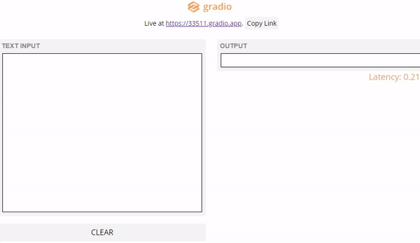

# translate_app_demo_with_11_lines_code

## Translate app demo with 11 lines of code

<p align="center">
    
    <br>
    <sup>Authors <a Demo</a></sup>
</p>

This repo is based on the following papers:
- [Gradio --> Rapidly create UIs for prototyping your machine learning model for TensorFlow, PyTorch and Jupyter Notebook] (https://www.gradio.app/)
- [Googletrans --> Free Google Translate API for Python] (https://pypi.org/project/googletrans/)

### install
```
pip install googletrans
pip install gradio
```
### Demo

